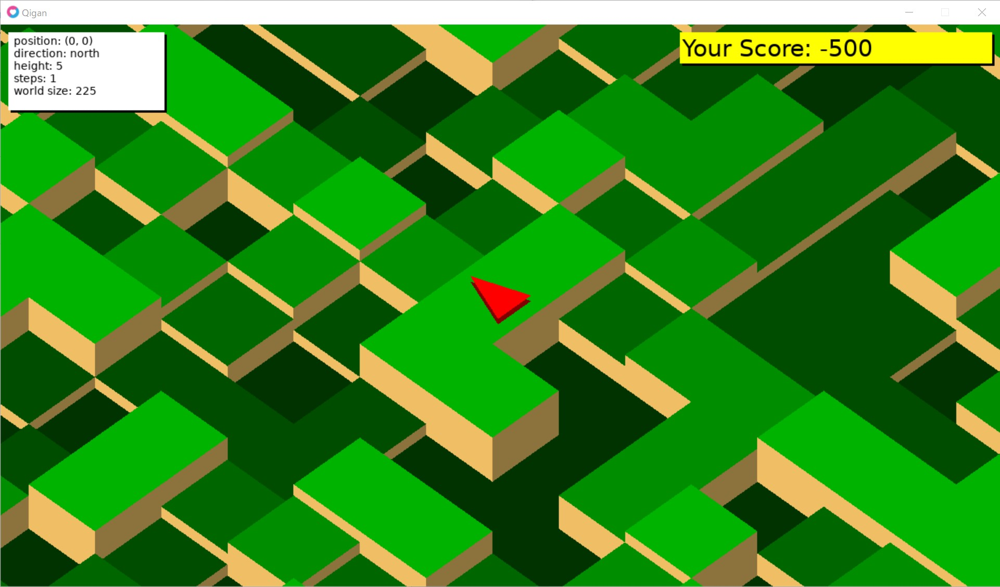

# qigan
an experimental gaming stuff for randomly generated field

ソースコードのコメントなどは日本語で書かれてあります。

## これはなにか？
ランダムに生成されるフィールドにおいて、特筆性が高いパターン（qigan、“奇岩”）を発見し、そのレアリティにふさわしいスコアを得る。

[Love2D](https://love2d.org/) ゲームエンジンを使用。記述言語はLua。

I really thank to the Love2D community and the Lua language sphere!

## 実行するには？
1. Love2Dをインストールする
2. このレポジトリをクローンする
3. Make
4. qigan.loveを実行

Love2D ver 11.4にてなんとなくの動作を確認。

## 遊び方

### ゲーム画面

- 赤い三角：プレイヤー
- 1歩動く事にスコアは-500
- 発見したqiganは青色の床と青色のマーカーで表示
- 発見したqiganを踏むと、レアリティにふさわしいスコアを得る。

#### 操作
- w,a,s,d ... プレイヤーを１歩動かす。
- f ... これまで発見したqiganとその個数を表示。Escで表示をキャンセル。
- Esc ... ゲームを終了する

## qiganの種類
- Totem
	- 3x3の平らなフィールドの中心に、そのフィールドより高さのある突起がある。
- Significantly Flat
	- 2x2の平らなフィールド。そして隣接フィールドよりそのフィールドは完全に低いまたは高い
- Commonly Flat
	- 2x2の平らなフィールド。ただし隣接フィールドの角部分の高さが任意。
- Ichimatsu
	- 3x3のフィールドが市松模様になっている。

また、パターン文字を用いて、任意の矩形サイズの、パターン文字で表現可能なパターンを新たに設定可能です。

## レアリティの計算方法
- qiganパターンから発生確率のようなものをでっち上げ、その逆数を取っている。

